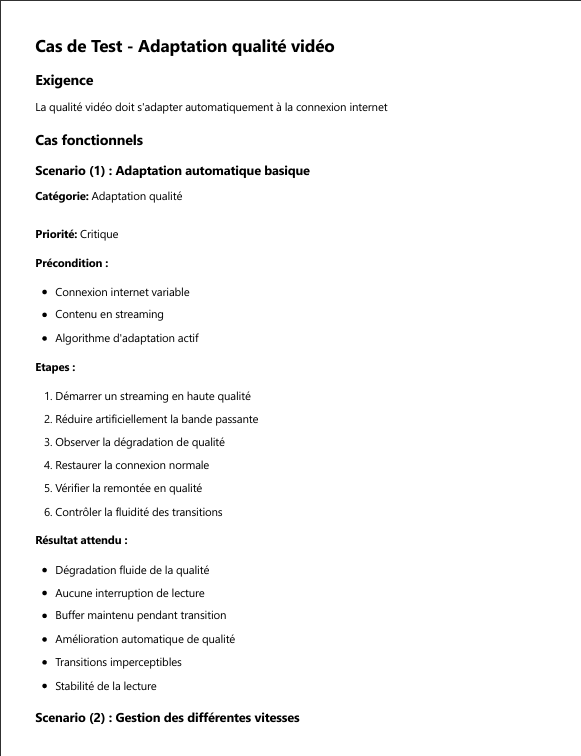

# 📄 Enterprise Use Case RAG Chatbot (FastAPI + Streamlit + Ollama)

This project is a **Retrieval-Augmented Generation (RAG) system** designed specifically for **retrieving information from enterprise use cases stored in PDFs**.  

Unlike a general-purpose chatbot, this assistant is focused: it only answers questions based on your enterprise use case documents (e.g., test case PDFs).  

It combines:
- ✅ Deterministic tools (for exact counts like “How many scenarios…?”)  
- ✅ Semantic search with FAISS + cached embeddings  
- ✅ Lightweight re-ranking (by filename keywords + scenario number)  
- ✅ Local LLM answers via [Ollama](https://ollama.com) (phi3:mini, llama3.2:1b, qwen2.5:1.5b, etc.)  
- ✅ Chatbot UI built with Streamlit  

---

## ✨ Features

- **Specialized domain** → retrieves and answers only about **enterprise use case PDFs**  
- **Deterministic counting** → exact scenario counts from structured metadata  
- **Semantic retrieval** → finds relevant context with FAISS embeddings  
- **Reranker** → boosts matches by filename keywords and scenario ID  
- **Fast local inference** → runs entirely on your machine with Ollama  
- **UI** → friendly chat interface with history  

---

## 📷 Example

Here is a screenshot of a use case being queried in the chatbot:



*(Replace this with your actual screenshot of a query & answer)*

---

## 🚀 Quickstart

### Requirements
- Python 3.10+
- [Ollama](https://ollama.com/download) installed
- Pull a local model (default: `phi3:mini`):
  ```bash
  ollama pull phi3:mini
```bash
# 1. Clone the repo
git clone https://github.com/AdilEddarif/Enterprise--LLM-RAG.git


# 2. Install dependencies
pip install -r requirements.txt

# 3. Install Ollama (if not installed) -> https://ollama.com/download
#    Pull the default model
ollama pull phi3:mini

# 4. Preprocess your PDFs
#    Put your enterprise PDF test cases inside the ./data folder first
python preprocess_usecases.py --pdf_dir ./data --out_dir ./processed

# 5. Start the FastAPI backend (leave this running)
uvicorn app:app --reload --port 8000

# 6. In a new terminal, start the Streamlit chatbot UI
streamlit run chat_ui.py
